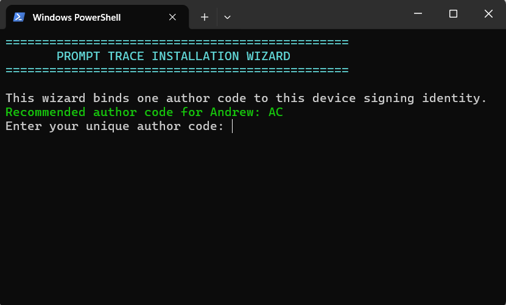
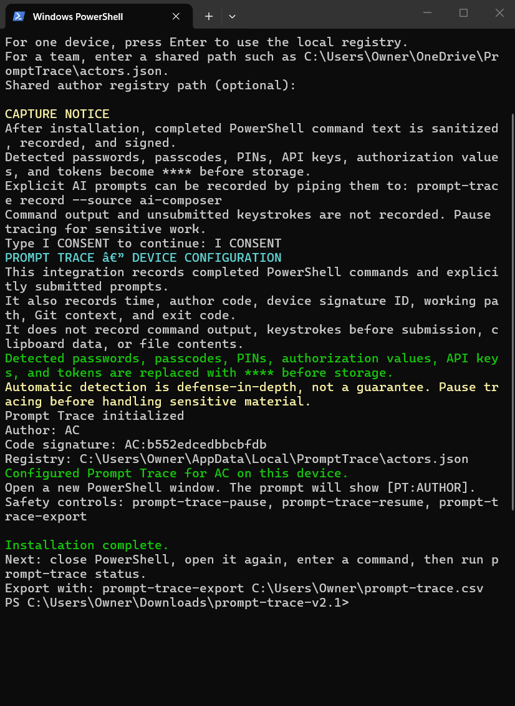

<p align="center"></p>

# PromptHub v1.0.0

> Local authorship provenance for submitted AI prompts and terminal commands.

[](https://github.com/healthearthack/prompt-trace/actions/workflows/ci.yml)
[](LICENSE)
[](#production-boundaries)

PromptHub places a compact authorship mark such as `[PT:AC]` before the typing caret, sanitizes the completed submission, signs it with a device-local Ed25519 key, and appends it to a tamper-evident local ledger. **PT means Prompt Trace.**

`AC` is Andrew Kieckhefer's founding claimed ID. It is not a default or example available to another user. Author IDs are permanent and never recycled.

## What v1.0.0 delivers

- A readable display name plus a unique **1–8-character alphanumeric author ID**.
- Hot-pink `[PT:AUTHOR]` attribution in supported AI composers and PowerShell.
- Local signatures, record IDs, hashes, timestamps, Git context, and chain verification.
- Credential redaction before storage for detected passwords, tokens, API keys, PINs, and authorization values.
- Local/shared device registries, plus a PostgreSQL model for authoritative global uniqueness.
- Managed enterprise issuance with one-time enrollment tokens.
- Signing credentials that expire after 100 years; IDs remain permanently reserved.
- CSV export for audit, research, and work-provenance review.
- Local Model Context Protocol (MCP) tools for ChatGPT desktop and Codex.
- Submit-boundary browser stamping that waits for modern editor state before send.

Prompt Trace is provenance software, not a legally qualified electronic-signature service or an employee-monitoring product. Users must consent. Automatic redaction is defense-in-depth, not a guarantee.

## Windows installation wizard

1. Download and extract the repository ZIP.
2. Open PowerShell in the extracted folder.
3. Run:

```powershell
Set-ExecutionPolicy -Scope Process Bypass
.\setup-wizard.ps1
```

4. Enter your full display name and your own available author ID. IDs accept only letters and numbers and are limited to eight characters.
5. Review the capture notice and type `I CONSENT`.
6. Close PowerShell completely and open a new window.





For macOS/Linux, run `chmod +x setup-wizard.sh && ./setup-wizard.sh`, then open a new Bash or Zsh terminal.

## Browser companion

The extension supports ChatGPT, Claude, Gemini, and Copilot in Chrome, Edge, and Brave.

1. Complete the Prompt Trace setup wizard.
2. Open `chrome://extensions` (Chrome/Brave) or `edge://extensions` (Edge).
3. Enable **Developer mode**, choose **Load unpacked**, and select `browser/extension`.
4. Copy the extension ID shown on the extensions page.
5. Run:

```powershell
.\browser\setup-native-host.ps1 -ExtensionId YOUR_EXTENSION_ID
```

6. Close **every window** of that browser, reopen it, and hard-refresh the AI chat page.

The composer should show a hot-pink mark such as `[PT:AC]` immediately before the caret. At submission, v1.0.0 waits for the editor state to accept the tag, transmits it with the prompt, and records the same title in the local signed ledger.

### Collaborative conversations

Each contributor installs Prompt Trace on their own device and enrolls a distinct permanent ID. A synchronized conversation can therefore contain messages such as:

```text
[PT:AC] Review the current release candidate.
[PT:SARAPENN] I verified the accessibility flow.
[PT:JOESPACK] I approved the deployment configuration.
```

Every collaborator viewing that same conversation sees the tags because they are part of the transmitted message text. Platform sharing behavior still applies: a copied or forked chat is not necessarily a live multi-user room.

A visible tag is authorship attribution, not cryptographic proof by itself; anyone can manually type text. Verification requires the corresponding signed ledger record, code-signature ID, and registered public key. Enterprise manager exports provide that matching audit evidence.

### Personal and organization context

Your author ID remains permanent while the optional organization context changes:

```powershell
prompt-trace set-context --organization ADP
```

New entries render as `[PT:AC · ADP]`. Return to personal context with:

```powershell
prompt-trace set-context
```

The organization is attribution metadata, not a second identity.

## Terminal Prompt Trace Curriculum Vitae

The standardized curriculum vitae exporter accepts user-selected raw inputs and creates one ZIP containing Markdown, Hypertext Markup Language, Portable Document Format, and Microsoft Word Open XML Document files. Every format uses the exact title **Terminal Prompt Trace Curriculum Vitae** and a restrained `ThePolka.Cloud · Prompt Trace` watermark.

```powershell
python -m cyber_cv .\cyber_cv\example.json --out .\terminal-prompt-trace-cv.zip
```

Cyber CV entries are opt-in. Excluding an entry removes it from the portfolio without altering the signed source ledger.

The extension cannot inject into the ChatGPT desktop app, Firefox, or a different browser profile. Fully restart the exact Chromium browser where it was loaded; merely reloading ChatGPT is sometimes insufficient after native-host changes.

## ChatGPT desktop and Codex

MCP means Model Context Protocol. Prompt Trace v1.0.0 supplies a local
standard-input/output (STDIO) MCP server. After completing the wizard, run:

```powershell
.\register-mcp.ps1
```

In the ChatGPT desktop app, open **Settings > MCP servers > Add server**, use
the command and argument printed by the registration script, save, and restart
ChatGPT. Type `/mcp` in the composer to confirm that Prompt Trace is connected.

For Codex command-line interface registration:

```powershell
.\register-mcp.ps1 -CodexCli
```

The MCP server exposes `prompt_trace_status`,
`prompt_trace_record_submission`, and `prompt_trace_recent`.

The browser extension can insert `[PT:AUTHOR]` into supported transmitted web
messages. MCP clients can record submitted activity and return its stamp and
record identifier, but the protocol does not rewrite a user's already-submitted
desktop composer text.

## Controls

```powershell
prompt-trace status
prompt-trace recent --limit 20
prompt-trace verify
prompt-trace-pause
prompt-trace-resume
prompt-trace-export "$HOME\prompt-trace.csv"
```

Use `prompt-trace-pause` before sensitive work.

## Local storage

| Data | Windows | macOS/Linux |
|---|---|---|
| Signed ledger | `%LOCALAPPDATA%\PromptTrace\prompt-ledger.jsonl` | `~/.prompt-trace/prompt-ledger.jsonl` |
| Device config | `%LOCALAPPDATA%\PromptTrace\config.json` | `~/.prompt-trace/config.json` |
| Local ID registry | `%LOCALAPPDATA%\PromptTrace\actors.json` | `~/.prompt-trace/actors.json` |
| Private signing key | `%LOCALAPPDATA%\PromptTrace\identity_ed25519` | `~/.prompt-trace/identity_ed25519` |
| CSV export | Path passed to `prompt-trace-export` | Path passed to `pt_export` |

Never publish the private key or raw ledger. They may contain submitted work even after redaction.

### Manager access

Managers do not automatically gain access to an employee's local ledger. After the organization establishes consent, access, and retention policy, the employee or authorized device administrator can publish a sanitized CSV to a restricted shared folder:

```powershell
.\enterprise\publish-audit.ps1 -DestinationFolder "\\server\PromptTrace\audits"
```

Managers find the per-employee exports in that folder and can merge them with:

```powershell
python .\enterprise\merge-audits.py "\\server\PromptTrace\audits" "\\server\PromptTrace\reports\all-employees.csv"
```

For opt-in near-real-time reporting, run `enterprise\start-live-sync.ps1` on enrolled devices and `enterprise\live-dashboard.py` on the manager's computer. The local dashboard refreshes every three seconds and shows all reporting author IDs, record counts, last-seen times, and latest signed entries.

See [enterprise/README.md](enterprise/README.md). This is explicit audit publication, not covert manager access.

## Identity, companies, and global uniqueness

A display name can contain spaces, such as `Joe Spack`. The visible author ID is 1–8 letters or numbers, such as `JOESPACK` or `EMP0042`, and normalizes to uppercase.

A local/shared JSON registry prevents duplicates only inside that registry. Guaranteeing that Northwestern Mutual and New York Life never issue the same ID requires one authoritative directory. [`registry/schema.sql`](registry/schema.sql) supplies the PostgreSQL model: `author_id` is a permanent primary key, company employment is a separate membership, and retired IDs are tombstoned rather than reused. The bootstrap registry records `AC` as founding reservation 1.

The database must be deployed with authenticated claims and serializable transactions before the product can truthfully promise worldwide uniqueness. See [registry/README.md](registry/README.md).

### Version 4 portable account layer

The v4 alpha PostgreSQL layer preserves one permanent account and author ID across personal computers, employer memberships, and future worker devices. Each computer has a separate revocable signing key, but all devices resolve to the same identity and `account_continuity` timeline. See [the metadata policy](registry/METADATA.md) and [v4 alpha release notes](RELEASE_NOTES_v4.0.0-alpha.1.md).

For managed company enrollment:

```powershell
.\enterprise\issue-author.ps1 `
  -AuthorId EMP0042 `
  -DisplayName "Employee Forty Two" `
  -Registry "\\server\PromptTrace\actors.json"
```

The employee uses the returned one-time enrollment token in the wizard. See [enterprise/README.md](enterprise/README.md).

## Upgrade from a development build

Prompt Trace v1.0.0 is the first stable public release. Earlier packages, including the v4.0.0 alpha database experiment, are treated as pre-release development builds rather than prior stable product releases.

1. Pause Prompt Trace and close all supported browsers.
2. Back up `%LOCALAPPDATA%\PromptTrace` on Windows or `~/.prompt-trace` on macOS/Linux.
3. Download or clone Prompt Trace v1.0.0 into a new directory. Do not overwrite the previous source directory.
4. Run the v1.0.0 setup wizard and preserve the same author ID when continuing an existing identity.
5. Reload `browser/extension` from the v1.0.0 directory.
6. Run `browser/setup-native-host.ps1` again using the installed extension ID.
7. Restart the exact browser profile where the extension was loaded.
8. Run `prompt-trace status`, `prompt-trace recent --limit 5`, and `prompt-trace verify`.
9. Keep the backup until the existing signed ledger verifies successfully under v1.0.0.

Do not copy another user's private key, configuration, registry, or raw ledger. Do not delete the earlier data directory until verification succeeds.
## Upgrade from a prerelease build

1. Pause Prompt Trace and close every supported browser.
2. Back up `%LOCALAPPDATA%\PromptTrace`. Never publish this folder because it can contain private signing material and recorded activity.
3. Download and extract Prompt Trace v1.0.0 into a new folder. Do not overwrite the previous installation in place.
4. Run `.\setup-wizard.ps1`, confirm the existing author identity when available, and review the consent boundary.
5. Reload `browser/extension` from the v1.0.0 folder and rerun `browser\setup-native-host.ps1` with the extension ID.
6. Restart the browser completely.
7. Run `prompt-trace status`, `prompt-trace recent --limit 5`, and `prompt-trace verify`.
8. Keep the backup until identity, ledger, browser, and export behavior have been verified.

Prerelease version numbers were development identifiers. Prompt Trace v1.0.0 is the first official stable public release.
## Known limitations

Prompt Trace v1.0.0 is the first public integration release.

- Browser stamping currently supports ChatGPT, Claude, Gemini, and Copilot in supported Chromium-based browsers.
- Firefox and the ChatGPT desktop composer do not currently support automatic visible-text insertion.
- Model Context Protocol integrations can record submitted activity and return an authorship stamp, but cannot rewrite text that a desktop client has already submitted.
- Terminal capture is integration-specific and is not a universal operating-system hook.
- Prompt Trace does not capture password fields, unsubmitted keystrokes, clipboard contents, command output, arbitrary files, or unrelated application activity.
- Automatic credential redaction is defense-in-depth and cannot guarantee detection of every sensitive value.
- Local and shared registries prevent duplicate author IDs only within their configured registry.
- Worldwide author-ID uniqueness requires deployment of the authoritative registry service.
- The production identity service, account recovery, organization administration, signed installer, key revocation, and independent security assessment remain future work.
- A visible `[PT:AUTHOR]` label is attribution, not cryptographic proof by itself. Verification requires the corresponding signed ledger record and public key.
## Capture boundary

Prompt Trace records completed PowerShell commands, explicitly submitted browser prompts, and activity explicitly passed through its MCP tool. It does not read command output, unsubmitted keystrokes, clipboard contents, password fields, or arbitrary files. Other terminals and AI products require explicit integrations. Installation does not mean invisible capture of all computer activity.

## Verify the product

```powershell
python -m unittest discover -s tests -v
python -m json.tool browser\extension\manifest.json
node --test tests\test_submission.js
```

GitHub Actions runs tests, validates the manifest, and checks extension JavaScript syntax on pushes and pull requests.

## Project map

- `prompt_trace.py` — identity, signing, redaction, verification, and CSV export.
- `setup-wizard.ps1` / `setup-wizard.sh` — consented device enrollment.
- `browser/extension` — Chromium composer UI and submission bridge.
- `browser/native_host.py` — local native-messaging signing bridge.
- `mcp_server.py` — local ChatGPT desktop and Codex integration.
- `enterprise` — managed company issuance.
- `registry` — authoritative global identity data model and bootstrap reservation.
- `graphics` — v3 logo and wizard screenshots.
- `tests` — identity, uniqueness, redaction, signature, and enrollment tests.

## Contributing

Help is welcome. The leading community project is an accessible native GUI setup wizard that replaces terminal setup while preserving explicit consent and local-first security. Read [CONTRIBUTING.md](CONTRIBUTING.md) and find issues labeled [`help wanted`](https://github.com/healthearthack/prompt-trace/labels/help%20wanted).

## Production boundaries

v1.0.0 is an integration preview. Core local signing, duplicate prevention, redaction, verification, managed enrollment, and the global-directory schema are implemented. A production launch still needs deployment of the authoritative directory, identity verification and account recovery, organization access controls, retention policy, security review, signed installers, and user/employee policy approval.

## License

[MIT](LICENSE)
