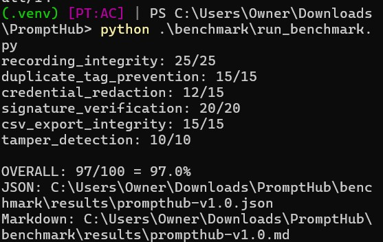

# PromptHub Provenance Benchmark

## PromptHub v1.0 Baseline

**Measured result: 97/100 controlled scenarios passed — 97.0%.**

PromptHub v1.0 was evaluated across 100 controlled provenance scenarios covering recording integrity, duplicate-tag prevention, credential redaction, signature verification, Comma-Separated Values export integrity, and tamper detection.

## Engineering Accomplishment

> **Achieved 97% PromptHub provenance reliability by engineering and validating a privacy-first authorship pipeline, as measured by 97 of 100 controlled scenarios passing across six provenance, security, and data-integrity categories.**

## Benchmark Results

| Category | Passed | Total | Score |
|---|---:|---:|---:|
| Recording integrity | 25 | 25 | 100% |
| Duplicate-tag prevention | 15 | 15 | 100% |
| Credential redaction | 12 | 15 | 80% |
| Signature verification | 20 | 20 | 100% |
| Comma-Separated Values export integrity | 15 | 15 | 100% |
| Tamper detection | 10 | 10 | 100% |
| **Overall** | **97** | **100** | **97.0%** |

## Execution Evidence

The following terminal capture documents execution of the PromptHub Provenance Benchmark v1.0.



```text
recording_integrity: 25/25
duplicate_tag_prevention: 15/15
credential_redaction: 12/15
signature_verification: 20/20
csv_export_integrity: 15/15
tamper_detection: 10/10

OVERALL: 97/100 = 97.0%